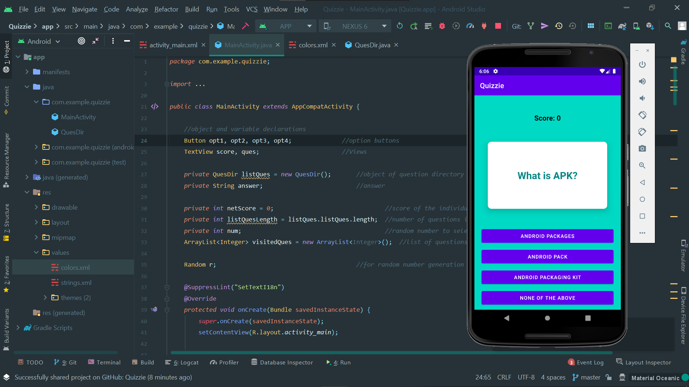
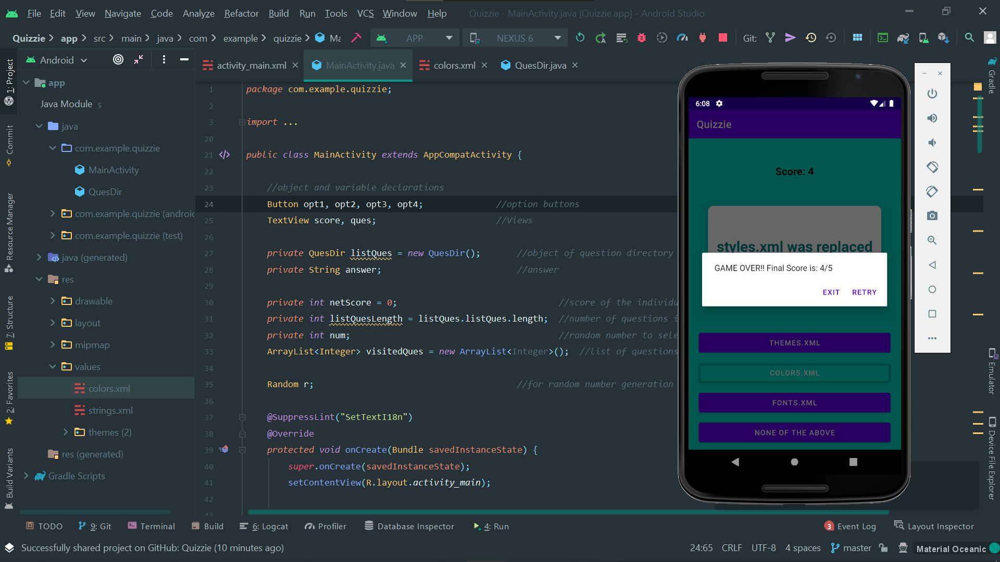

# Quizzie
A single screen quiz app.
# Quizzie
****This app uses some hardocded questions stored in a java class file, to conduct a small quiz of 5 Questions, shows 4 options selects the correct one and shares the score****

****What I Learned Through This Project:****

****1. *Using Alerts.*****

****2. *Using ConstraintLayout.*****

****3. *Managing App Lifecycle.*****
